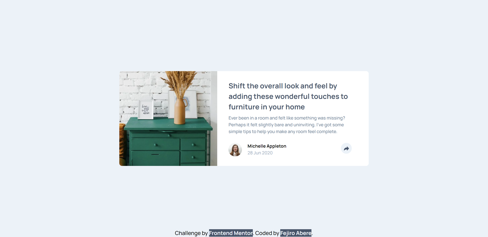

# Frontend Mentor - Article preview component solution

This is a solution to the [Article preview component challenge on Frontend Mentor](https://www.frontendmentor.io/challenges/article-preview-component-dYBN_pYFT). Frontend Mentor challenges help you improve your coding skills by building realistic projects.

## Table of contents

- [Overview](#overview)
  - [The challenge](#the-challenge)
  - [Screenshot](#screenshot)
  - [Links](#links)
- [My process](#my-process)
  - [Built with](#built-with)
  - [What I learned](#what-i-learned)
  - [Continued development](#continued-development)
  - [Useful resources](#useful-resources)
- [Author](#author)

## Overview

### The challenge

Users should be able to:

- View the optimal layout for the component depending on their device's screen size
- See the social media share links when they click the share icon

### Screenshot



### Links

- Solution URL: [Solution](https://fejiro001.github.io/article-preview-component-master/)
- Live Site URL: [Live Site]()

## My process

### Built with

- Semantic HTML5 markup
- Flexbox
- Mobile-first workflow
- TailwindCSS - For styles

### What I learned

Created a popup

```css
@layer components {
  .mobile-popup {
    @apply absolute flex flex-wrap right-0 bottom-0 p-7 w-full z-10 rounded-t-none rounded-b-lg gap-4 bg-dark-grayish-blue me-0 items-center;
  }
  @media (min-width: 850px) {
    .mobile-popup {
      @apply rounded-lg right-[-55px] bottom-24 py-4 px-8 w-fit;
    }
    .mobile-popup::after {
      content: "";
      position: absolute;
      top: 100%;
      left: 50%;
      margin-left: -5px;
      border-width: 10px;
      border-style: solid;
      border-color: hsl(217, 19%, 35%) transparent transparent transparent;
    }
  }
}

.show {
  @apply animate-fadeIn visible;
}
```

### Useful resources

- [CSS Popup](https://www.w3schools.com/css/css_popup.asp) - This helped me in creating a popup.

## Author

- Frontend Mentor - [@Fejiro001](https://www.frontendmentor.io/profile/Fejiro001)
- Twitter - [@aberefejiro](https://www.twitter.com/aberefejiro)

